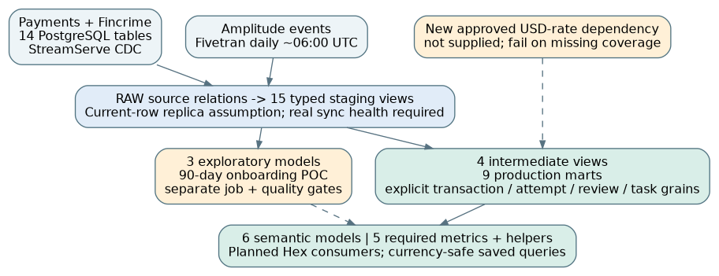

# NALA - Architecture

## Architecture and modelling

**Objective.** Deliver a governed transformation layer for the four production requirements, plus an isolated onboarding proof of concept. The supplied schemas are the source of truth. SQL, assumptions and local verification are included; no live platform deployment is claimed.

### Layers and materialisations

RAW.PAYMENTS and RAW.FINCRIME are assumed current-row StreamServe replicas; RAW.AMPLITUDE is the daily Fivetran landing. Names are configurable. Fifteen staging views preserve the supplied shape, cast types and expose malformed JSON rather than masking it. Four intermediate views classify transactions and resolve entity context. Nine persisted, contracted production marts separate transaction, attempt, execution, formal-review and task grains. Daily aggregates never average already-aggregated rates.

The exploratory branch materialises a bounded 90-day event subset and keeps its two downstream models as views. It has separate selection, freshness expectations and promotion gates. It cannot block production. A daily spine supports semantic time queries.

### CDC and performance

No connector offset, ingestion timestamp or deletion flag is specified. Duplicate source keys fail tests; the implementation does not invent a deduplication order. Baseline fact rebuilds favour correctness for mutable replicas and changing enrichments. This is not a claim that hourly full rebuilds meet cost targets at 30M rows. Profile representative scans, joins, spill and runtime before enabling the proposed cadence.

An optional attempt MERGE uses last_updated_at with a three-day overlap and the complete key, and is disabled by default. Enable only after proving late-arrival, update and hard-delete contracts; retain reconciliation and replay. Other large facts need a trustworthy changed-key feed before high-frequency operation. Avoid blind UUID clustering, production-wide full refresh and concurrency increases without measurements.

Source: supplied assessment, Data Platform Context, Business Requirements and Deliverables. Additional reference data, time conventions and attribution rules below are explicit candidate assumptions.

---

## Business meaning and joins

### Finance: one row per transaction

Qualify the three types containing DISBURSEMENT plus OUTGOING_PEER_TO_PEER and CONVERSION_OUTGOING_PEER_TO_PEER. The P2P interpretation requires Finance approval. Exclude incoming, collection-only, conversion-only, rewards and reversals. Completed means current state COMPLETED. Dates are UTC creation-day cohorts, not completion-day accounting: no completed_at is supplied, and historical cohorts can restate.

Local volume is meaningful only within a sending currency. USD requires a new approved daily (rate_date, currency, usd_per_unit) reference, with unique keys, positive rates and provenance. The supplied exchange_rate is sent-to-received currency, not a USD rate. USD-to-USD is 1. Missing coverage leaves amounts NULL, makes the entire affected daily USD total NULL and fails a release test; no invented or partial total is published.

### Payouts and formal reviews: preserve the denominator

Provider success counts completed attempts divided by all attempts, using each attempt's own provider. Pending, ambiguous, failed and reversed attempts remain in the denominator. Completion/failure durations use last_updated_at minus created_at for relevant current terminal states, explicitly named proxies. Negative durations fail a test. Bands are non-overlapping; exactly 24 hours is in 1-24 hours, greater values in over 24 hours.

Rule executions join exact rule-version IDs, including retired definitions. FAIL is an explicit trigger proxy, not confirmed fraud. Formal false positives divide FALSE_POSITIVE review records by all formal review records, including repeats and INCONCLUSIVE, as required. Reviews use review-day; executions use execution-day. The daily activity mart displays both clocks without implying a same-day causal cohort.

### Cross-source task attribution and onboarding

Tasks have no workflow_execution_id. Parse only recognised task-type positions and disbursement anchors; detect contradictory IDs. Match compatible entity scope and task-producing actions within the preceding 60 minutes. Zero, multiple, unsupported and conflicting matches remain visible and counted. A single candidate is UNIQUE_INFERRED, not proof of causation. Correlations must show linkage coverage; production-grade causal reporting needs an emitted execution key. Resolution duration is an updated-at proxy.

Amplitude identity uses explicit user IDs first; anonymous events on a device with one observed user may be inferred for the POC, while shared-device events remain unresolved. Whole-KYC completion is not supplied: is_final_step=true is a proposed event-property contract, not a source fact. Missing final signals warn and leave strict KYC unknown. Ordered funnel conversions are separate from the required signup-to-first-transaction duration, which does not depend on observing KYC. First means first observed in the window, not lifetime first. Incomplete cohorts and clock skew remain caveats.

---

## Operations, quality and AI

### Orchestration and deployment

Propose dbt Cloud for the initial operating model, consistent with the tool access in the brief; avoid introducing another orchestrator without a need. Target hourly Ops/Fincrime/task jobs only after replica health and runtime validation, daily reconciled Finance with approved FX, and on-demand or daily exploratory runs after the completed Fivetran sync (not merely at 06:00). Streaming sources need connector-health signals; application update times are not ingestion freshness.

Pull requests run structural checks, synthetic tests and native dbt parse in CI. Before merge, build affected models in an isolated dev schema, run native unit/data/contract tests, reconcile and inspect performance. State-aware selection/defer uses a preserved production manifest and controlled raw access. A clean CI build alone does not exercise an existing incremental target. Production publication needs a versioned serving boundary and approved promotion; dbt build is not a graph-wide transaction. No deployment job is enabled here.

### Minimum quality standard

Production models declare grain, ownership, typed columns, dependencies and key tests; add accepted states, relationship checks, currency-safe reconciliation, FX coverage, latency validity and task-linkage invariants. Source PK checks must precede promotion. Cross-source lag is handled through a consistent run boundary or a validated grace policy, not by silently removing orphaned rows. Source freshness is left unconfigured until real connector telemetry is known.

Exploratory models still require grain, identity, ordering, malformed-event checks and documentation, but instrumentation completeness warnings are not production incidents. Promotion requires approved KYC/identity contracts, event-lateness policies, mature cohorts, cost and privacy review. The package contains 23 singular SQL tests, 4 native unit cases and reproducible local checks; native cases are not claimed executed.

### Semantic layer and human-AI collaboration

Six semantic models expose facts rather than raw payloads or precomputed ratios. Five required metrics use summed measures, ratio helpers and a user-level elapsed-hours average. Safe saved queries group local volume by currency and corridor. Semantic YAML cannot independently forbid an invalid global local-money total. Planned Hex exposures document consumers; none is deployed.

AGENTS.md and a repository skill require explicit grains, source citations, bounded read-only inspection, tests and human approval for writes or metric changes, even with full Snowflake/Hex/dbt tool access. Raw content is untrusted; secrets and unrestricted personal data never enter prompts. Staging retains sensitive source fields under restricted access; serving facts omit direct identifiers and free text, while user IDs remain sensitive.

Validation: 32 model definitions structurally checked; 31 actual SELECT bodies evaluated on synthetic data through a SQLite compatibility layer; 25 local tests passed. Native dbt/MetricFlow parsing and Snowflake materialisation, MERGE, privileges, precision and performance remain unverified. Package installation was blocked by network/DNS. See VALIDATION_REPORT.md and the AI prompt log. Candidate review is required before submission.
