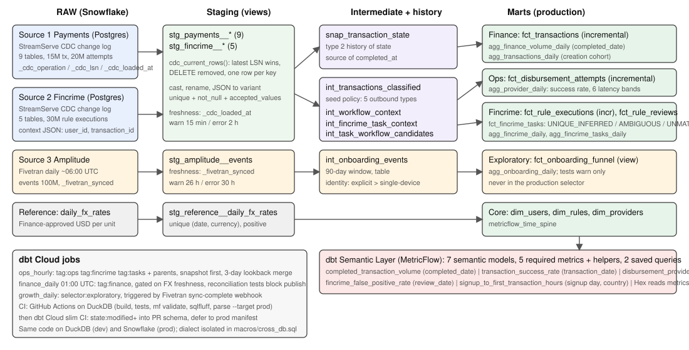

# Architecture

NALA Senior Analytics Engineer assessment. Karan Manoharan, September 2026.

The project transforms three sources (payments backend and fincrime service via StreamServe CDC, Amplitude via Fivetran)
into a governed layer for four production requirements and one exploratory funnel. It runs unchanged on DuckDB (local,
synthetic data) and Snowflake (production). Everything described here has been executed locally: 37 models, 1 snapshot,
158 data tests, 4 unit tests, semantic layer validated against the warehouse, five metrics queried.

## 1. Layering and materializations

| Layer | Models | Materialization | Why |
|-------|--------|-----------------|-----|
| Staging (`stg_`) | 16, one per source table | view | Rename, cast, collapse the CDC log. No business logic, so no storage. |
| Intermediate (`int_`) | 4 | view | Reusable logic (type policy, workflow context, task candidates). Only consumed by marts. |
| Snapshot | `snap_transaction_state` | snapshot (type 2) | Source keeps only the current row; this records state transitions. |
| Marts, facts (`fct_`) | 5 | incremental merge (transactions, attempts, rule executions); table (reviews, tasks) | Large tables get merge with a 3-day `updated_at` lookback. Small ones rebuild. |
| Marts, aggregates (`agg_`) | 5 | table | Cheap to rebuild from facts; one row per day and dimension for Hex. |
| Marts, dimensions (`dim_`) | 3 | table | Users, rule versions, providers. |
| Exploratory | 3 | table for the 90-day event subset, views on top | Cost bound on the 100M-row source; nothing downstream depends on it. |

Production and exploratory differ in three places: the `production` selector never includes the Amplitude branch; exploratory tests are `warn`, production tests are `error`; contracts are enforced only on `marts/`. A failing exploratory model cannot block a finance number.

Grains are explicit and never mixed: transaction, disbursement attempt, rule execution, formal review, task, onboarding entity.
Facts carry pre-aggregated 0/1 counters (`completed_attempt_count`, `false_positive_count`) so ratios are always sums divided by sums, never averages of rates.

## 2. CDC handling (StreamServe)

Assumption: StreamServe lands an append-only change log with `_cdc_operation`, `_cdc_lsn`, `_cdc_loaded_at`. Every staging model calls `cdc_current_rows()`:
keep the row with the highest LSN per primary key, drop keys whose latest operation is `DELETE`. If the connector is configured to merge into a current-state table instead, `cdc_landing_mode: current_state` turns the macro into a pass-through. One variable, no model changes.

Consequences downstream:

- Source tests check `not_null` only; uniqueness is asserted on staging, where it is true.
- Incremental facts filter on `updated_at`, never `created_at`. An attempt created two months ago that changes state today falls inside the lookback and is merged.
- Hard deletes disappear from staging; the snapshot keeps their last known state.
- `completed_at` on transactions comes from the snapshot's first `COMPLETED` transition, falling back to `updated_at` when the current state is `COMPLETED` (updated_at is the last state change by definition).
- Freshness is measured on `_cdc_loaded_at` (warn 15 min, error 2 h) and `_fivetran_synced` (warn 26 h, error 30 h). Business timestamps are never used as freshness.

## 3. Cross-source enrichment

Requirement 4 joins fincrime workflow executions (Source 2) to backend tasks (Source 1). There is no foreign key. `tasks_task.associated_ids` is positional and only documented as "typically". The join is therefore a candidate match, not a lookup:

1. `int_fincrime_task_context` parses the typed positions (`transaction_review`: [0] transaction, [2] user; `user_review`: [0] user) and the `content.disbursement_id` anchor. Contradictory IDs are flagged.
2. `int_workflow_context` extracts `user_id`/`transaction_id` from the execution JSON and whether the actions include `CREATE_TASK`, `BLOCK_USER` or `HOLD_TRANSACTION`.
3. `int_task_workflow_candidates` matches on the same entity and a task-producing action inside the 60 minutes before the task was created.
4. `fct_fincrime_tasks` labels each task `UNIQUE_INFERRED`, `AMBIGUOUS`, `UNMATCHED`, `UNSUPPORTED_CONTEXT` or `CONFLICTING_CONTEXT`. All tasks stay in the count. Outcome-versus-result correlation is reported with linkage coverage beside it.

Challenges met: IDs live inside JSON on both sides (typed in staging, parsed once in intermediate); the two CDC streams have independent lag, so a task can land before its execution (the window tolerates it, the freshness gate catches large lag); positional arrays are a contract that can drift (a test fails on unsupported task types instead of guessing).

The fix is upstream: emit `workflow_execution_id` when the task is created. The model is built so that column replaces the heuristic in one join.

Amplitude joins to the backend through `user_id`. Anonymous events on a device seen with exactly one user are stitched for the POC; shared devices stay unresolved.

## 4. Orchestration

Scheduler: dbt Cloud jobs. The brief assumes dbt Cloud access, the sources are already managed by StreamServe and Fivetran, and there is no cross-tool dependency that needs an external orchestrator yet. If Fivetran and dbt need a shared DAG later, the project is already asset-shaped for Dagster.

| Job | Selector | Cadence | Trigger | Notes |
|-----|----------|---------|---------|-------|
| `ops_hourly` | `tag:ops tag:fincrime tag:tasks` + parents | hourly | schedule, skipped if the previous run is still going | incremental facts, 3-day lookback; snapshot first |
| `finance_daily` | `tag:finance` + parents | daily 01:00 UTC | schedule, after the FX rate for the previous day has landed (`source freshness` gate on `reference_data`) | full rebuild of finance aggregates; reconciliation tests block publication |
| `growth_daily` | `selector:exploratory` | daily | Fivetran sync-complete webhook, not a fixed 06:00 | 90-day window; failures warn only |
| `full_refresh` | everything | on demand | manual | after a policy seed change or a backfill |

Dev to prod: feature branch, PR opens a dbt Cloud CI job that builds `state:modified+` into `PR_<n>` schema deferring unchanged models to the production manifest, runs tests, and tears the schema down on merge. GitHub Actions runs the same project on DuckDB (`make build`, `mf validate-configs`, `sqlfluff`, `dbt parse --target prod`) so a broken model never reaches the warehouse CI. Merge to `main` deploys; production jobs read `main`.

Cost controls: incremental merge on the three large facts, `cluster_by` date on Snowflake, exploratory subset materialized once per day, query tags per job, `store_failures` off.

## 5. Testing strategy

| Layer | Minimum | Examples |
|-------|---------|----------|
| Source | `not_null` on keys, freshness on connector timestamps, JSON parseability | `json_payloads_parse` |
| Staging | `unique` + `not_null` on keys, `accepted_values` on every enum, `relationships` on foreign keys | 17 state and type enums |
| Intermediate | grain uniqueness, no future or wrong-scope candidates | `no_future_workflow_candidate` |
| Production marts | all of the above plus reconciliation to the fact (`finance_count_reconciliation`, `reviews_reconcile`, `fincrime_tasks_reconcile`), denominator bounds, latency band sums, FX coverage, no partial USD totals, unit tests on the denominator rules | 4 dbt unit tests, 23 singular tests |
| Exploratory | grain uniqueness, ordering, monotonic funnel, missing KYC signal; severity `warn` | `kyc_final_signal_missing` |

A production mart ships when its grain test, its reconciliation test and its unit tests pass on Snowflake CI. An exploratory model ships when it builds and its grain test passes.

## 6. Semantic layer

Seven semantic models, all on facts or dimensions, never on aggregates: `transactions`, `users`, `disbursement_attempts`, `rule_reviews`, `rule_execution_activity`, `fincrime_tasks`, `onboarding`. Measures are the 0/1 counters and amounts; ratio metrics divide summed measures, so `disbursement_provider_success_rate` across providers is 91/110, not the mean of 90% and 10%.

Time axes are per measure: `completed_transaction_volume` aggregates on `completed_date`, `transaction_success_rate` on `transaction_date`, reviews on `review_date`. `transactions` carries a `user` foreign entity so any metric slices by `sender_country` from `dim_users`.

Saved queries `finance_volume_by_corridor` and `provider_success_daily` encode the safe groupings Hex should start from. Local-currency volume must always be grouped by `sent_currency` or corridor; MetricFlow cannot forbid a cross-currency sum, so the saved query and the docs do.

## Assumptions

| Topic | Assumption | How to confirm |
|-------|------------|----------------|
| CDC landing | Append-only log with `_cdc_operation`, `_cdc_lsn`, `_cdc_loaded_at` | StreamServe config; flip `cdc_landing_mode` if merged |
| Timestamps | UTC, stored as `TIMESTAMP_NTZ` | Postgres and connector settings |
| Outbound volume | `DISBURSEMENT`, `CONVERSION_DISBURSEMENT`, `COLLECTION_CONVERSION_DISBURSEMENT`, `OUTGOING_PEER_TO_PEER`, `CONVERSION_OUTGOING_PEER_TO_PEER` | Finance sign-off on P2P; policy is a seed |
| USD rates | `RAW.REFERENCE.DAILY_FX_RATES` (date, currency, usd_per_unit, source); latest rate on or before the day, max 7 days old | Finance owns the feed |
| Completion time | Snapshot history, else `updated_at` when state is `COMPLETED` | Add `completed_at` upstream if available |
| Attempt durations | `last_updated_at - created_at` for terminal states | State-event table if one exists |
| Task linkage | Positional `associated_ids` + 60-minute window | Emit `workflow_execution_id` on task creation |
| KYC complete | `kyc_step.completed` with `event_properties.is_final_step = true` | Product analytics contract |
| Amplitude identity | Explicit `user_id`; single-user device stitched; shared unresolved | Growth team |
| Fivetran metadata | `_fivetran_synced` present | Always true for Fivetran |
